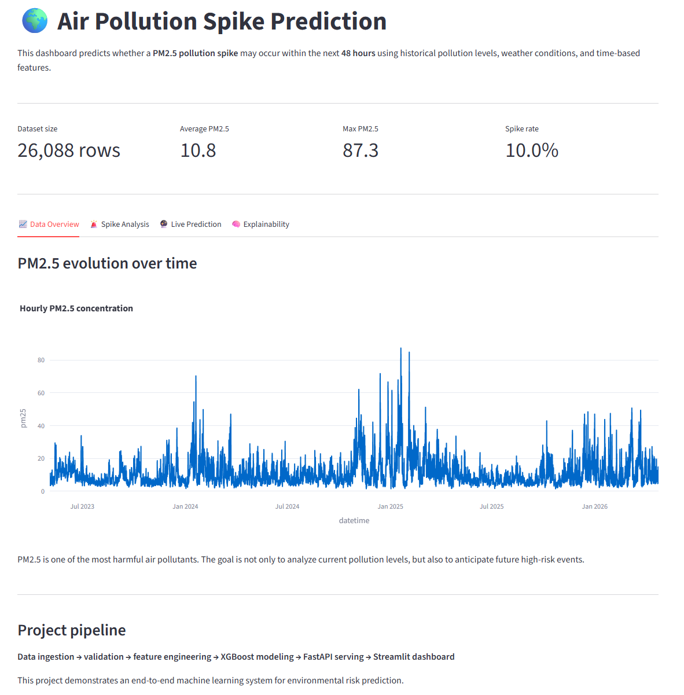
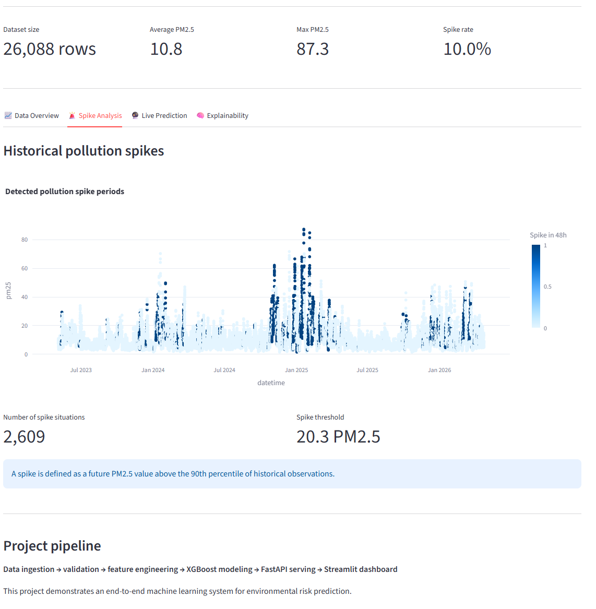
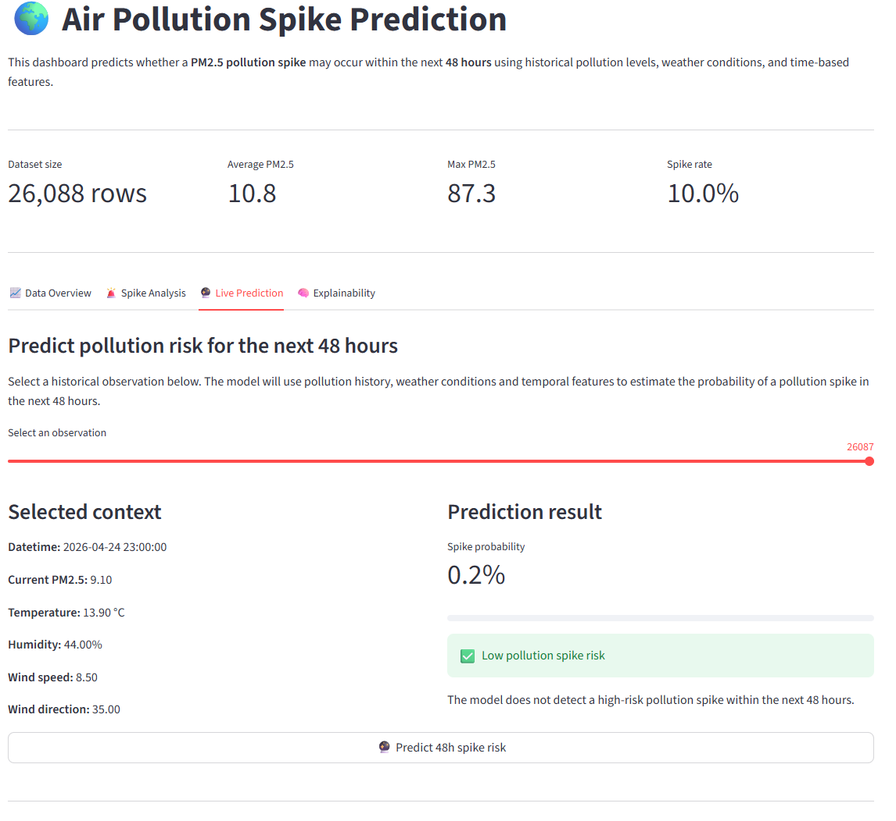
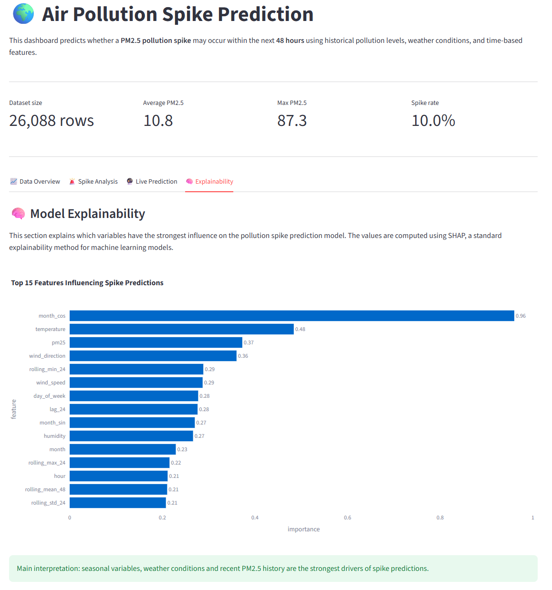

# 🌍 Air Pollution Spike Prediction System

An end-to-end Machine Learning system designed to predict air pollution spikes 48 hours in advance using historical PM2.5 measurements, weather conditions, and advanced time-series feature engineering.

---

# 🚀 Live Demo

## 🌐 Streamlit Dashboard


```text
https://air-pollution-dashboard.onrender.com
```

## ⚡ FastAPI Backend


```text
https://air-pollution-api.onrender.com
```

---

# 📌 Project Overview

Air pollution is a major environmental and public health issue.
This project aims to anticipate severe PM2.5 pollution events 48 hours ahead using:

* historical pollution measurements
* meteorological conditions
* temporal patterns
* explainable machine learning

The system includes:

✅ Data ingestion pipeline
✅ Data validation pipeline
✅ Feature engineering for time-series forecasting
✅ XGBoost regression and classification models
✅ Rare-event spike detection
✅ Explainability with SHAP
✅ FastAPI model serving
✅ Streamlit interactive dashboard
✅ Dockerized deployment
✅ Cloud deployment on Render

---

# 📸 Dashboard Screenshots

## Data Overview


## Spike Analysis


## Live Prediction


## Explainability



# 🏗️ System Architecture

```text
           ┌────────────────────┐
           │   Streamlit UI     │
           │  Dashboard Layer   │
           └─────────┬──────────┘
                     │ REST API
                     ▼
           ┌────────────────────┐
           │   FastAPI Backend  │
           │ Prediction Service │
           └─────────┬──────────┘
                     │
                     ▼
           ┌────────────────────┐
           │  XGBoost Models    │
           │ Regression + Spike │
           └─────────┬──────────┘
                     │
                     ▼
           ┌────────────────────┐
           │ Feature Engineering│
           │  Validation Layer  │
           └─────────┬──────────┘
                     │
                     ▼
           ┌────────────────────┐
           │ Multi-API Ingestion│
           │ Weather + Pollution│
           └────────────────────┘
```

---

# 📊 Dataset

## 🌫️ Air Quality Data

Source:

* Open-Meteo Air Quality API

Features:

* PM2.5 concentration

## 🌦️ Weather Data

Source:

* Open-Meteo Archive API

Features:

* temperature
* humidity
* wind speed
* wind direction

## ⏱️ Time Coverage

* 3 years of hourly observations
* ~26,000 rows

---

# 🧠 Machine Learning Tasks

## 1. PM2.5 Forecasting

Regression model predicting PM2.5 concentration 48 hours ahead.

### Model

* XGBoost Regressor

### Metrics

| Metric | Result |
| ------ | ------ |
| MAE    | 4.05   |
| RMSE   | 5.13   |
| R²     | 0.584  |

---

## 2. Pollution Spike Detection

Binary classification task predicting whether a severe pollution spike will occur within 48 hours.

### Model

* XGBoost Classifier

### Metrics

| Metric    | Result |
| --------- | ------ |
| Accuracy  | 0.736  |
| Precision | 0.248  |
| Recall    | 0.575  |
| F1-score  | 0.347  |

### Business Optimization

The classification threshold was intentionally optimized for recall to reduce missed severe pollution events.

---

# ⚙️ Feature Engineering

The project includes advanced time-series feature engineering:

## Lag Features

* lag_1
* lag_3
* lag_6
* lag_12
* lag_24
* lag_48
* lag_72
* lag_168

## Rolling Statistics

* rolling_mean_6
* rolling_mean_12
* rolling_mean_24
* rolling_mean_48
* rolling_std_24
* rolling_max_24
* rolling_min_24

## Temporal Features

* hour
* day_of_week
* month
* weekend indicator

## Cyclic Encoding

* hour_sin / hour_cos
* month_sin / month_cos

## Weather Interaction Features

* temperature × humidity

---

# 🧠 Explainable AI

The system integrates SHAP explainability to understand which variables influence pollution spike predictions.

Top influencing features include:

* seasonal patterns
* temperature
* historical PM2.5 trends
* wind conditions
* humidity

---

# 🌐 API Endpoints

## Health Check

```http
GET /
```

## PM2.5 Forecast

```http
POST /predict-regression
```

## Pollution Spike Prediction

```http
POST /predict-spike
```

---

# 📊 Streamlit Dashboard

The dashboard includes:

✅ PM2.5 time-series visualization
✅ Historical spike analysis
✅ Real-time prediction interface
✅ SHAP explainability visualization
✅ Interactive UI

---

# 🐳 Docker Deployment

The application is fully containerized using:

* Docker
* Docker Compose

Services:

* FastAPI backend
* Streamlit frontend

---

# ☁️ Cloud Deployment

Deployed on Render using separate services:

* FastAPI backend service
* Streamlit frontend service

---

# 🛠️ Tech Stack

## Data Engineering

* Python
* Pandas
* Requests

## Machine Learning

* XGBoost
* Scikit-learn
* SHAP

## Backend

* FastAPI
* Uvicorn

## Frontend

* Streamlit
* Plotly

## Infrastructure

* Docker
* Docker Compose
* Render

---

# 📂 Project Structure

```text
ml-project/
│
├── dashboard/
│   └── app.py
│
├── data/
│   ├── raw/
│   └── processed/
│
├── models/
│   ├── xgboost_pm25_48h.pkl
│   └── xgboost_spike_classifier.pkl
│
├── src/
│   ├── api/
│   ├── data/
│   ├── models/
│   └── utils/
│
├── Dockerfile.api
├── Dockerfile.dashboard
├── docker-compose.yml
├── requirements.txt
└── README.md
```

---

# ▶️ Local Installation

## Clone repository

```bash
git clone <your-repository-url>
cd ml-project
```

## Create virtual environment

```bash
python -m venv venv
```

## Activate environment

### Windows

```bash
source venv/Scripts/activate
```

### Linux/macOS

```bash
source venv/bin/activate
```

## Install dependencies

```bash
pip install -r requirements.txt
```

---

# ▶️ Run Locally

## Start API

```bash
python -m uvicorn src.api.app:app --reload
```

## Start Streamlit Dashboard

```bash
streamlit run dashboard/app.py
```

---

# 🐳 Run with Docker

```bash
docker compose up --build
```

---

# 📈 Future Improvements

Potential next steps:

* LSTM / Deep Learning forecasting
* MLflow experiment tracking
* Drift monitoring
* Airflow orchestration
* Kubernetes deployment
* Real-time streaming ingestion
* Multi-city forecasting

---

# 👨‍💻 Author

Moussa Dia

Data Science • Machine Learning • MLOps • AI Engineering

---

# ⭐ If you found this project interesting

Consider giving the repository a star ⭐
